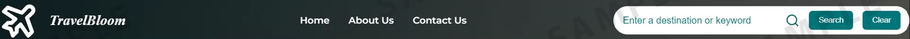
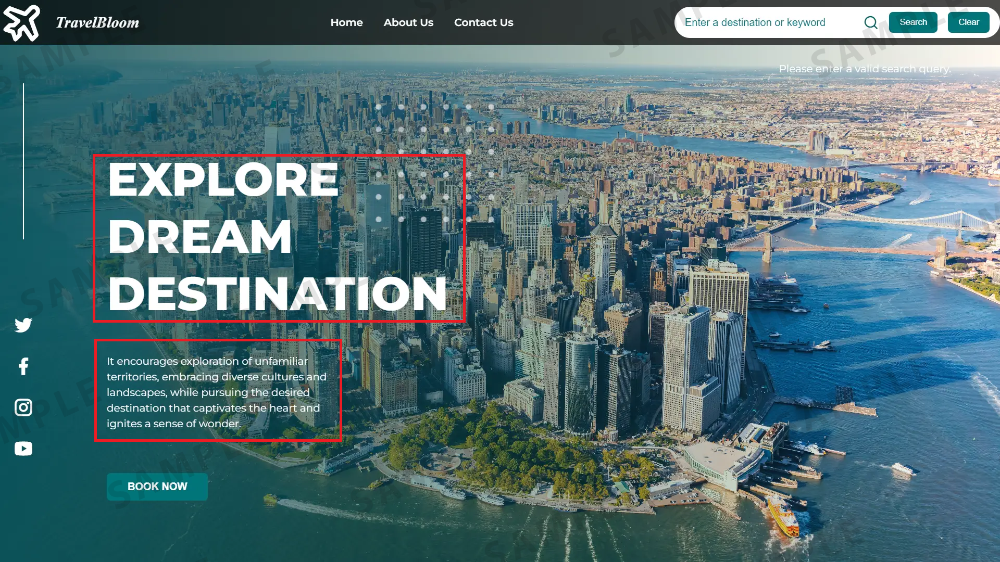

# Hands-on Lab: Travel Recommendation Web Application

## Introduction
In this final project, you will create a webpage layout for a travel recommendation platform.

This website will include:

- A navigation bar with links to the home page, "About Us" and "Contact Us" pages
- A search bar allowing users to input destinations or keywords to search for recommendations
- A content section that showcases an enticing background image, social media links, and a headline emphasizing exploration and destination discovery
- A brief description promoting cultural exploration
- A "Book Now" button

You will be able to implement the knowledge and skills you have gained from working on the practice project to help you handle dynamic functionalities, like search recommendations and result presentation.

## Learning objectives
After completing this lab, you will be able to:

**Enhanced user navigation**: Implement an intuitive navigation bar with clear links to the Home, About Us, and Contact Us sections, ensuring a user friendly website.

**Search functionality integration**: Develop a search feature allowing users to input destinations or keywords, enabling the 'Search' and 'Clear' buttons to retrieve and reset dynamically displayed recommendations promptly.

**Visual appeal and brand representation**: Create an aesthetically pleasing landing page with visually engaging elements, including a logo, social media icons, and captivating visuals, to enhance brand recognition and user engagement.

**JavaScript functionality**: Utilize JavaScript to enable dynamic functionalities, such as live search recommendation fetching, interactivity for user inputs, or potential API integrations, enhancing the website's functionality and user experience.

## Prerequisites
- Basic knowledge of HTML and GitHub
- Basic understanding of JavaScript functions, the Fetch API method, strings, arrays
- Web browser with a console (Chrome DevTools, Firefox Console, and so on)

## Setting up the environment
You need to create one blank online GitHub repository and name it according to the name of your travel recommendation website.

**Important!** Make sure your repository is public because your peers will need to review your work.

Also, ensure that the name of the repository and the folder you are going to create in Point 3 should be the same.

Do not create README.md files or others not included in this project.

On the window to the right, click on Explorer as shown at 1 in the screenshot below. Click on the project folder and again click on the icon highlighted in red at 2 in the screenshot. Enter the folder name `travelRecommendation`. It will create a folder for you. Then select the `travelRecommendation` folder shown at 3, right-click, and select New File. Enter the file name `travel_recommendation.html` and click OK. It will create your HTML file.

Again, right click on the `travelRecommendation` folder and select a New File. Enter the file name `travel_recommendation.js` and click OK. It will create your JavaScript file.

To create a JSON file, right-click on the `travelRecommendation` folder again and select a New File. Enter the file name `travel_recommendation_api.json` and click OK. It will create your JSON file.

Click on this link travel_recommendation_api and copy data, then paste into the `travel_recommendation_api.json` file and then save it.

**Note:** This data will act as API data where details for travel-based recommendation information are available.

## Task list
Your required tasks for this project are listed below. Your peers will assess you on each of them.

### Task 1: HTML template
Create a basic HTML template structure in the `travel_recommendation.html` file. It should include these tags:

- `<html>`
- `<head>`
- `<body>`

Within the `<head>` tag include a `<title>` tag.
Write your website name in the `<title>` tag to set up the title of each web page.

### Task 2: Navbar
For this task, you need to create a navigation bar. The navbar should contain the following:

- Home page link using anchor tag `<a>` to navigate to home page
- About us page link using anchor tag `<a>` to navigate to about us page
- Contact Us page link using anchor tag `<a>` to navigate to contact us page
- A search bar to allow users to enter keywords to search for recommendations
- A Search button to execute the search after the user clicks on it
- A Reset button to clear results.

The screenshot below shows a sample navigation bar:

You can also include your website name and logo if you wish.

### Task 3: Home page
In this task, you will design a Home page which must include:

- A background image
- An introduction to this website

You can see an example home page with these elements in this screenshot:

You can also include icons on the home page for social media platforms.

**Note:** You can also include CSS in the HTML code based on the themes and the images you choose.

### Task 4: About us
In this task, you need to create an About Us page, which should include:

- Information about the company
- An introduction to the team members, displaying their names and their designated roles

**Note:** Make sure that you include the code for the navbar. The navbar on this page should only include Home, About Us, and Contact Us menu items, not the search bar and buttons.

The screenshot below shows a sample About Us page.

