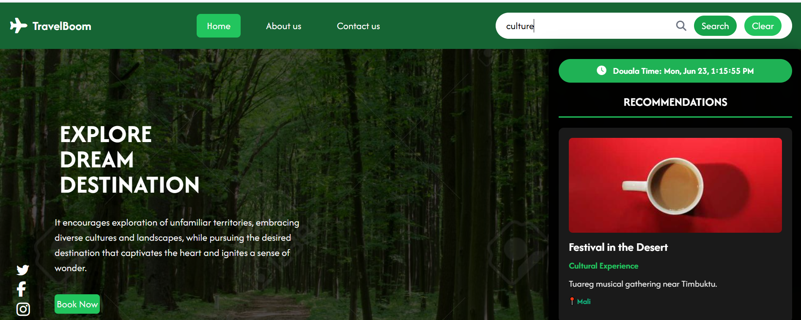
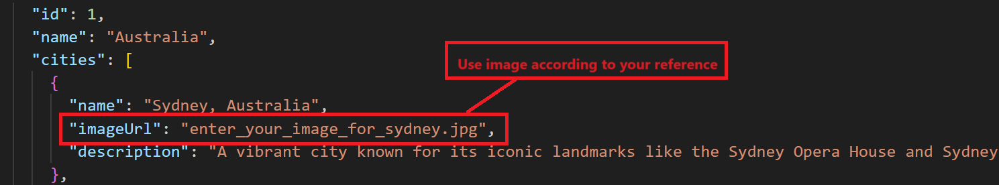
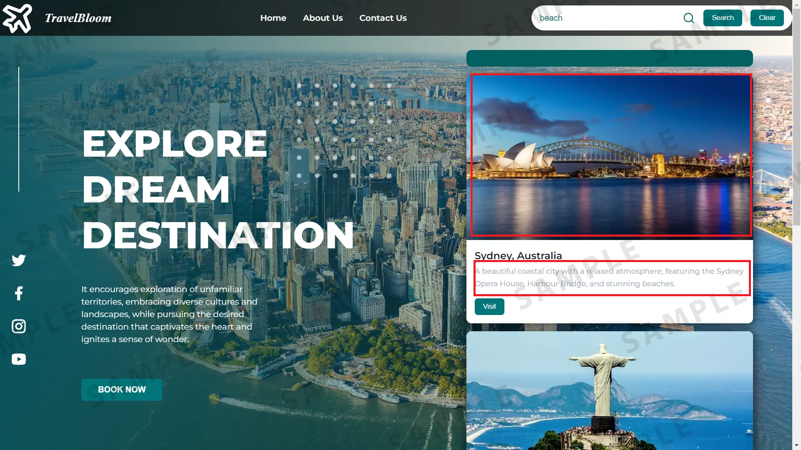

# Hands-on Lab: Travel Recommendation Web Application



## Introduction
In this final project, you will create a webpage layout for a travel recommendation platform.

This website will include:

- A navigation bar with links to the home page, "About Us" and "Contact Us" pages
- A search bar allowing users to input destinations or keywords to search for recommendations
- A content section that showcases an enticing background image, social media links, and a headline emphasizing exploration and destination discovery
- A brief description promoting cultural exploration
- A "Book Now" button

You will be able to implement the knowledge and skills you have gained from working on the practice project to help you handle dynamic functionalities, like search recommendations and result presentation.

## Learning objectives
After completing this lab, you will be able to:

**Enhanced user navigation**: Implement an intuitive navigation bar with clear links to the Home, About Us, and Contact Us sections, ensuring a user friendly website.

**Search functionality integration**: Develop a search feature allowing users to input destinations or keywords, enabling the 'Search' and 'Clear' buttons to retrieve and reset dynamically displayed recommendations promptly.

**Visual appeal and brand representation**: Create an aesthetically pleasing landing page with visually engaging elements, including a logo, social media icons, and captivating visuals, to enhance brand recognition and user engagement.

**JavaScript functionality**: Utilize JavaScript to enable dynamic functionalities, such as live search recommendation fetching, interactivity for user inputs, or potential API integrations, enhancing the website's functionality and user experience.

## Prerequisites
- Basic knowledge of HTML and GitHub
- Basic understanding of JavaScript functions, the Fetch API method, strings, arrays
- Web browser with a console (Chrome DevTools, Firefox Console, and so on)

## Setting up the environment
You need to create one blank online GitHub repository and name it according to the name of your travel recommendation website.

**Important!** Make sure your repository is public because your peers will need to review your work.

Also, ensure that the name of the repository and the folder you are going to create in Point 3 should be the same.

Do not create README.md files or others not included in this project.

On the window to the right, click on Explorer as shown at 1 in the screenshot below. Click on the project folder and again click on the icon highlighted in red at 2 in the screenshot. Enter the folder name `travelRecommendation`. It will create a folder for you. Then select the `travelRecommendation` folder shown at 3, right-click, and select New File. Enter the file name `travel_recommendation.html` and click OK. It will create your HTML file.

Again, right click on the `travelRecommendation` folder and select a New File. Enter the file name `travel_recommendation.js` and click OK. It will create your JavaScript file.

To create a JSON file, right-click on the `travelRecommendation` folder again and select a New File. Enter the file name `travel_recommendation_api.json` and click OK. It will create your JSON file.

Click on this link travel_recommendation_api and copy data, then paste into the `travel_recommendation_api.json` file and then save it.

**Note:** This data will act as API data where details for travel-based recommendation information are available.

## Task list
Your required tasks for this project are listed below. Your peers will assess you on each of them.

### Task 1: HTML template
Create a basic HTML template structure in the `travel_recommendation.html` file. It should include these tags:

- `<html>`
- `<head>`
- `<body>`

Within the `<head>` tag include a `<title>` tag.
Write your website name in the `<title>` tag to set up the title of each web page.

### Task 2: Navbar
For this task, you need to create a navigation bar. The navbar should contain the following:

- Home page link using anchor tag `<a>` to navigate to home page
- About us page link using anchor tag `<a>` to navigate to about us page
- Contact Us page link using anchor tag `<a>` to navigate to contact us page
- A search bar to allow users to enter keywords to search for recommendations
- A Search button to execute the search after the user clicks on it
- A Reset button to clear results.

The screenshot below shows a sample navigation bar:


You can also include your website name and logo if you wish.

### Task 3: Home page
In this task, you will design a Home page which must include:

- A background image
- An introduction to this website

You can see an example home page with these elements in this screenshot:


You can also include icons on the home page for social media platforms.

**Note:** You can also include CSS in the HTML code based on the themes and the images you choose.

### Task 4: About us
In this task, you need to create an About Us page, which should include:

- Information about the company
- An introduction to the team members, displaying their names and their designated roles

**Note:** Make sure that you include the code for the navbar. The navbar on this page should only include Home, About Us, and Contact Us menu items, not the search bar and buttons.

The screenshot below shows a sample About Us page.


### Task 5: Contact us
In this task, you need to create a Contact Us page, which should contain the following:

A form for users in case they want to reach out
The form should contain:
- `<input>` boxes for name and email
- `<textarea>` for users to write their message
- Submit button to submit the form


### Task 6: Recommendation results
Now, you need to create logic in your JavaScript file to show results for your recommendations.

**Note:** You should check the output of your code while developing your JavaScript. Directions to view your output are on the next page of these instructions.

Fetch data from the `travel_recommendation_api.json` file using the fetch API method, from there you can fetch travel-related details, such as the name of the place. You need to have your own images for every imageUrl in the JSON file.

Fetch the data from the JSON using the `fetch API()` method. To check if you can access the data, you use `console.log` to see if the result is displayed.

It is good if the `console.log` logs the data. Otherwise, you need to look for a different API.



### Task 7: Keyword searches
In this task, you will write JavaScript to accept these keywords and variations the user will enter in the search field in your navigation bar on the home page.

For example, if the user enters "beach," or "beaches," "Beach" or "BEACH," then you need to write JavaScript code so that it accepts all variations of this keyword.

For uppercase letters in the keyword, you can convert them to lowercase in your JavaScript using the string manipulation `toLowerCase()` method.

Similarly, you need to create logic to match keywords entered for temples and countries.

The website should display results only after the user clicks the Search button.



### Task 8: Recommendations
In this task, you need to fetch the details of the places you recommend based on which keyword the user enters: beach, temple, or country.

For each of these three keywords, your results should display at least two recommendations, an image, and a description. The results should display dynamically just under the search bar on the right of the homepage with a high z-index.


### Task 9: Clear button
Create logic in your JavaScript file for a clear button to clear the results. To implement this feature, you can create a function that will be called after clicking on the clear button in the navbar.

The clear button should:
- Clear the search input field
- Remove all displayed search results
- Reset the search interface to its initial state


### Task 10: Country date and time (optional)
In this optional task, you can create logic in your JavaScript to display the time in the country you recommend.

For Example:

```javascript
const options = { timeZone: 'Africa/Douala', hour12: true, hour: 'numeric', minute: 'numeric', second: 'numeric' };
const newYorkTime = new Date().toLocaleTimeString('en-US', options);
console.log("Current time in New York:", newYorkTime);
```

This JavaScript code retrieves the current time in the New York time zone using the Date object and the toLocaleTimeString method.

- `timeZone: 'Africa/Douala'` sets the time zone to New York
- `hour12: true` specifies that the time should be displayed in 12-hour format (AM/PM)
- `hour: 'numeric', minute: 'numeric', second: 'numeric'` indicate that the hour, minute, and second components should be displayed numerically
- `new Date()` creates a new Date object representing the current date and time
- `toLocaleTimeString('en-US', options)` formats the time according to the specified options


## Skills Learned Summary

Throughout this travel recommendation web application project, you have successfully developed and demonstrated proficiency in the following key web development skills:

### Frontend Development
- **HTML5 Structure**: Created semantic HTML templates with proper document structure
- **CSS3 Styling**: Implemented responsive design with custom CSS and Tailwind CSS framework
- **Responsive Design**: Built mobile-first layouts that adapt to different screen sizes
- **CSS Grid & Flexbox**: Used modern layout techniques for complex page structures

### JavaScript Programming
- **DOM Manipulation**: Dynamically created and modified HTML elements
- **Event Handling**: Implemented click events, form submissions, and keyboard interactions
- **Fetch API**: Retrieved data from JSON files using asynchronous JavaScript
- **Array Methods**: Processed and filtered data using modern JavaScript techniques
- **String Manipulation**: Implemented case-insensitive search with keyword variations

### User Interface & Experience
- **Navigation Systems**: Built responsive navigation with mobile hamburger menus
- **Search Functionality**: Created dynamic search with real-time results display
- **Form Handling**: Developed contact forms with proper validation and styling
- **Interactive Elements**: Added hover effects, transitions, and smooth animations

### Advanced Features
- **Time Zone Integration**: Implemented international time display using JavaScript Date API
- **Image Handling**: Managed dynamic image loading with fallback placeholders
- **State Management**: Controlled application state for search results and menu toggles
- **Performance Optimization**: Implemented efficient scrolling and hidden scrollbars

### Design & Branding
- **Color Theory**: Applied consistent forest green theme throughout the application
- **Typography**: Used custom fonts and responsive text sizing
- **Visual Hierarchy**: Created clear information architecture with proper spacing
- **Brand Identity**: Developed cohesive visual identity with logos and consistent styling

### Project Management
- **Version Control**: Organized code structure with proper file management
- **Documentation**: Created comprehensive README with task breakdowns
- **Testing**: Implemented console logging for debugging and verification
- **Deployment Preparation**: Structured project for GitHub Pages deployment

This project demonstrates full-stack frontend development capabilities, combining modern web technologies to create a professional, responsive, and interactive travel recommendation platform.